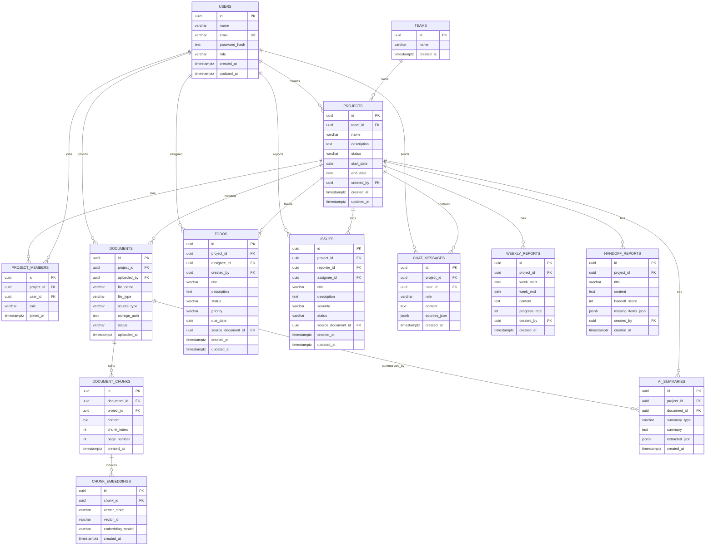

# TeamMemory DB Design v2

## Summary

TeamMemory는 개인 메모장이 아니라 프로젝트 단위 인수인계 서비스다. 따라서 DB의 중심은 `users`가 아니라 `projects`이며, 문서, Todo, 이슈, 채팅, 보고서, 인수인계 결과는 모두 `project_id`로 묶는다.

이번 v2 설계는 프론트 화면의 핵심 영역인 대시보드, Todo/이슈, 자료 업로드, AI 챗봇, 주간 보고, 인수인계 점수를 바로 조회할 수 있게 만드는 것을 목표로 한다.

## ERD

## Design Rules

- 모든 업무 데이터는 `project_id` 기준으로 분리한다.
- `project_members`가 프로젝트 접근 권한의 기준이다.
- Todo와 Issue는 AI가 추출할 수 있지만, 화면과 집계를 위해 별도 테이블에 저장한다.
- 문서 원문은 `documents`, RAG 검색 단위는 `document_chunks`, 외부 벡터 저장소 연결 정보는 `chunk_embeddings`에 둔다.
- 실제 embedding vector는 초기 버전에서 DB에 직접 저장하지 않고 외부 vector store의 `vector_id`만 저장한다.
- JSON 필드는 AI 추출 결과, 챗봇 출처, 인수인계 누락 항목처럼 구조가 자주 변할 수 있는 데이터에만 사용한다.

## Files

- `db/schema.postgresql.sql`: PostgreSQL DDL
- `db/seed.postgresql.sql`: 팀원 5명 기준 샘플 데이터
- `db/dashboard-queries.postgresql.sql`: 프론트/백엔드가 바로 참고할 조회 쿼리
- `docs/table-definition.md`: 테이블 정의서
